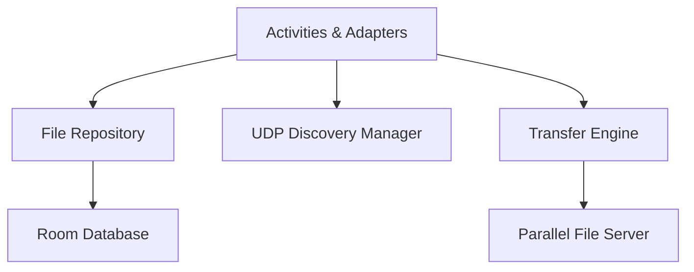

# ⚡ UltraFastTransfer

UltraFastTransfer is a high-performance Android file sharing application designed for fast, local network transfers between nearby devices without requiring cloud services or internet connectivity.

Built using Java, Room Database, UDP device discovery, and a custom transfer engine, UltraFastTransfer enables users to discover devices, browse files, and transfer large files across a local network with minimal setup.

---

## Features

### Device Discovery

* Automatic LAN device discovery
* UDP-based peer detection
* Real-time device availability updates

### File Browser

* Browse internal storage
* Navigate folders
* Preview supported media
* Multi-file selection

### High-Speed File Transfer

* Parallel transfer architecture
* Multi-file transfer support
* Background transfer processing
* Transfer progress tracking

### Transfer History

* Local transfer records
* Persistent history storage
* Room Database integration

### Modern Android UI

* Material Design components
* Adaptive layouts
* Dark mode support
* Animated discovery experience

---

## Architecture



---

## Core Components

### Networking

* UDP Discovery Manager
* Device Discovery Service
* Parallel File Server
* Transfer Engine

### Data Layer

* Room Database
* DAO Pattern
* Repository Pattern

### UI Layer

* MainActivity
* DiscoveryActivity
* TransferActivity
* FileBrowserActivity

---

## Technology Stack

| Category     | Technology         |
| ------------ | ------------------ |
| Language     | Java               |
| Database     | Room SQLite        |
| Networking   | UDP Sockets        |
| UI           | Android XML        |
| Architecture | Repository Pattern |
| Build System | Gradle             |

---

## Project Structure

```text
app/
├── data/
├── db/
├── network/
│   ├── discovery/
│   └── transfer/
├── ui/
└── repository/
```

---

## Transfer Flow

```text
Start Discovery
      ↓
Find Nearby Devices
      ↓
Select Device
      ↓
Browse Files
      ↓
Choose Files
      ↓
Transfer Engine
      ↓
Parallel Transfer
      ↓
Transfer History
```

---

## Performance Goals

* Fast LAN device discovery
* Low transfer overhead
* Parallel file streaming
* Efficient database operations
* Large file support

---

## Future Roadmap

### Planned

* Transfer resume support
* End-to-end encryption
* QR device pairing
* Cross-platform desktop client
* Wi-Fi Direct support

### Research

* Multi-device broadcasting
* Distributed file synchronization
* Background transfer service

---

## License

Licensed under the MIT License.
